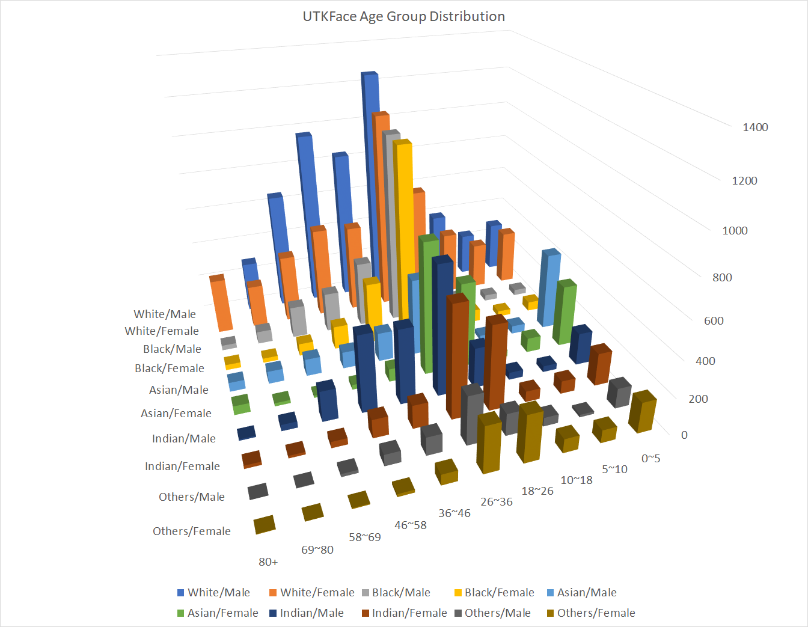
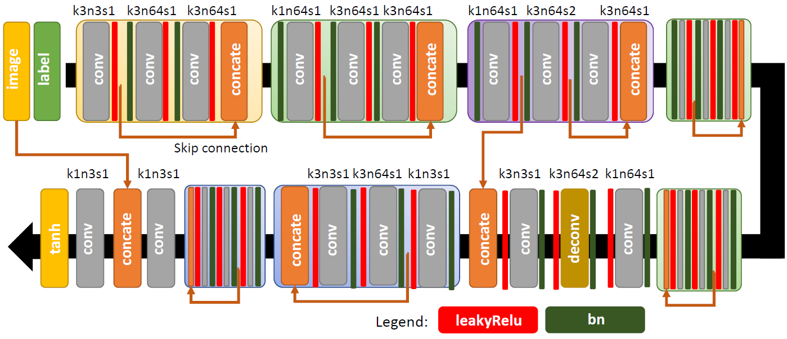
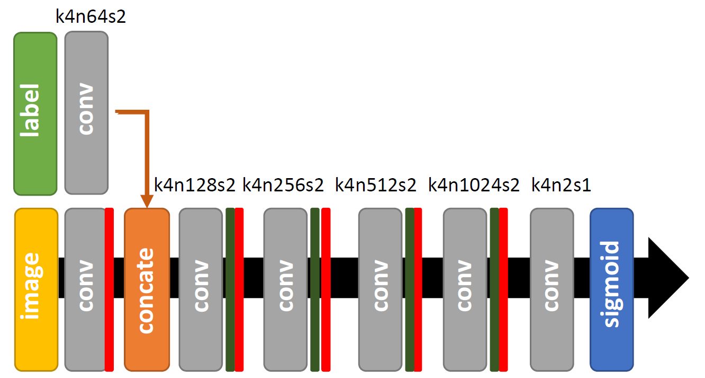
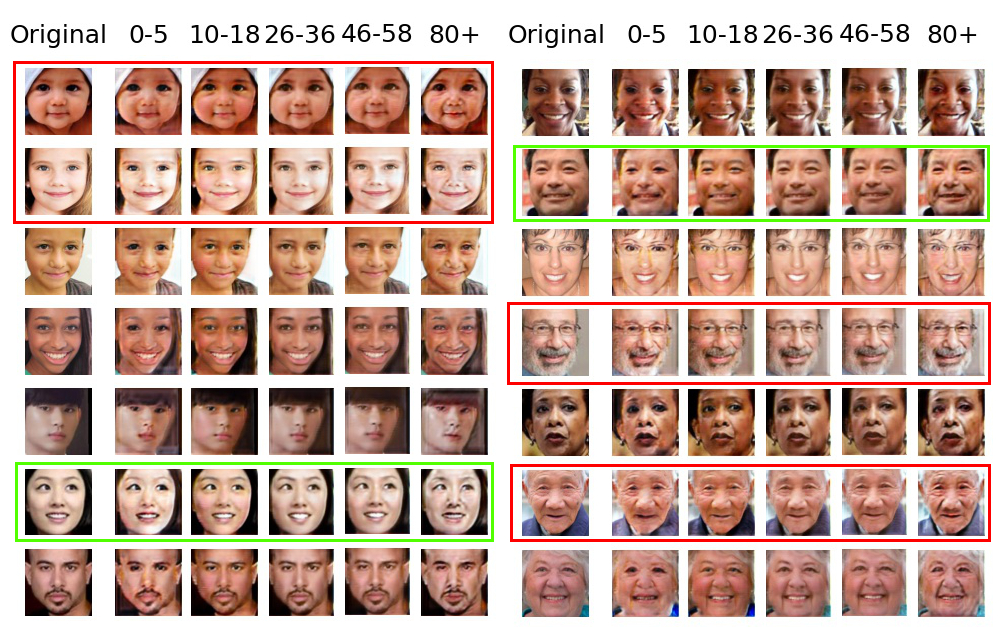

# ESTR3108 Face Aging Project

Our Face Aging project was developed in another private repository.
This repository is only used for providing open access to our Face Aging project.
All source code we used to train the neural network is placed inside [SourceCode](./SourceCode).

***

# Table of Contents
- [Objectives](#Objectives)
- [Dataset](#Dataset)
- [Pre-Processing](#Pre-processing)
- [Network Architecture](#Architecture)
    - [Generator](#Generator)
    - [Age Discriminator](#Agediscriminator)
- [Training](#Training)
- [Results](#Results)
- [References](#References)

***

***

## Objectives
In this project, our basic goal is to design a model that could accept an image of the user and an age group chosen by him/her, then our model will generate an aging face of the user with a consistent age group. We want our generated image not only to be a random person with a consistent age group, but also preserve the identity of the inputted image, i.e. from the input image and the generated image, we are able to tell that they are the same person. For further improvement, we hope our model can deal with some manually modified features to the inputted image, such as give a pair of glasses to that person, adding a tattoo etc. so that we could predict the aging face of the same person with various features.

***

## Dataset

For this project, we used the [**UTKFace**](https://susanqq.github.io/UTKFace/) dataset set as our training data. The UTKFace dataset consists of over 20,000 face images paired with age, gender and ethnicity labels. The age span of the dataset is between 1 year old to 116 years old. Ethnicity is grouped into 5 groups, namely White, Black, Asian, Indian, and Others. The dataset also provided aligned and copped images which have size of 200\times200. We used these aligned and copped images for our project, and we further resized them to 128*128 for simplicity. 

***

## Pre-Processing
|UTKFace Data Distribution|
|:---:|
||

We used aligned and cropped images from UTKFace dataset, and further reduced their size to 128*128 pixels. In order to better encode age information as a one hot vector, we grouped face images at different ages into 10 age groups. Originally, we divided images from every 10 years into a single group. However, we observed that faces in younger age groups(0-20 years old) change rapidly, while faces from older age groups(80+ years old) change subtly. Based on this observation, we decided to divide faces into 10 age groups as below:
|Age Group|Age Span|
|:---:|:---:|
|1|[0, 5)|
|2|[5, 10)|
|3|[10, 18)|
|4|[18, 26)|
|5|[26, 36)|
|6|[36, 46)|
|7|[46, 58)|
|8|[58, 69)|
|9|[69, 80)|
|10|80+|

This also enhanced our training process of the neural network as images are relatively fairly distributed into different age groups.

***

## Network Architecture
Our neural network model is mainly taken from [**Face Aging with Contextual Generative Adversarial Nets**](https://arxiv.org/abs/1802.00237) with some modifications. Instead of using 2 discriminative networks as proposed in the original paper, we used only 1 discriminative network to achieved the face translation ability.

### Generator
Our generator design is taken from the paper Face Aging with Contextual Generative Adversarial Network as shown in this figure.

##### Image taken from [**Face Aging with Contextual Generative Adversarial Nets**](https://arxiv.org/abs/1802.00237)

The design consists of several layers of repeated structure, each consists of several layers of convolution layer followed by a **LeakyReLU** activation layer and a batch normalization layer. **k**, **n**, **s** represents **kernel size**, **number of kernels**, and **strides** respectively. The generator design also consists of several skip connections. These skip connections later proved to be very effective on preserving personal identity. The generator takes as input an image **x**, and an one hot vector **y** which encodes the age group we want the generator to translate the image into. The generator then produces a generated image **x'**. We can represent the process of generating images as **x'**=**G(x, y)** which **G** is the generator. In our implementation, both input image **x** and generated image **x'** are 3 channel face image with size 128*128. The one hot vector **y** is a 10 dimensional vector, which represents an age group as above.

### Age Discriminator
Our age discriminator is also based on the architecture described in the paper Face Aging with Contextual Generative adversarial network.

##### Image taken from [**Face Aging with Contextual Generative Adversarial Nets**](https://arxiv.org/abs/1802.00237)

As shown in the above figure, the network is made up with several layers of repeated structure, each composed of a convolution layer, a batch normalization layer, and a **LeakyReLU** activation layer. The age discriminator network accepts as input an image x and an age group one hot vector **y**, then produce a 2 dimensional vector **z** as output. The output vector **z** indicates how likely the input pair is a positive pair. The age discriminator can thus be expressed as **z**=**D(x, y)**. Here, we take[1.0, 0.0] as positive samples, and [0.0, 1.0] as negative samples. The positive training pair of the age discriminator is real face image **x_y** with corresponding correct age label **y**. The negative training pair is either real face image **x_y** with inconsistent age label **y'**, where **y'**!=**y**, or generated fake image **x'** with random age label **y**. By this means, we hope our age discriminate can not only distinguish real and generated images, but also be able to tell if the age label is not consistent with the image.

***

## Training
Our model was trained on CUHK Central Research Computing Cluster with Nvidia Titan X GPU. The model was trained for 16 hours with batch size 50, which can sit inside a 12GB graphics card memory. When training age discriminator, we used categorical cross-entropy as it’s loss function. To train the generator, we used categorical cross-entropy as the loss function for the generative adversarial network.

***

## Results

The result is shown in the above figure. For images in the red box, those results are not very favourable. For images in green box, the results are better.
From the red box on the left hand side, we can see the network didn’t perform very well. In those cases, input images are taken from group 1, with age between 0-5 years old. The network didn’t translate faces into the corresponding age as we expected. Similar things also happened for images in red boxes on the right hand side. It seems that for images that require dramatic changes like reshaping the face and removing mustache, the network didn’t perform well.

There are also a few examples with positive results. For the image in the green box on the right hand side, we can see the network performs quite well. The model learned to remove wrinkles from the middle-aged gentleman to produce a younger image, and augment wrinkles to simulate the aging effect. For the lady in the green box on the left hand side, we can also see the aging effect is significant.

We can conclude that the neural network performs better for translation that produces similar results. For translation between very young and very old images, the network performs poorly as there are dramatic changes between input and target output. The network also suffered from special facial feature translation, like removing mustaches from images with thick mustaches. 

***

## References

- B. Tiddeman, M. Burt and D. Perrett, "Prototyping and transforming facial textures for perception research," in IEEE Computer Graphics and Applications, vol. 21, no. 5, pp. 42-50, July-Aug. 2001, doi: 10.1109/38.946630.

- J. Suo, S. Zhu, S. Shan and X. Chen, "A Compositional and Dynamic Model for Face Aging," in IEEE Transactions on Pattern Analysis and Machine Intelligence, vol. 32, no. 3, pp. 385-401, March 2010, doi: 10.1109/TPAMI.2009.39.

- G. Antipov, M. Baccouche and J. Dugelay, "Face aging with conditional generative adversarial networks," 2017 IEEE International Conference on Image Processing (ICIP), Beijing, 2017, pp. 2089-2093, doi: 10.1109/ICIP.2017.8296650.

- S. Liu, Y. Sun, D. Zhu, R. Bao, W. Wang, X. Shu, and S. Yan, “Face Aging with Contextual Generative Adversarial Nets,” arXiv.org, 01-Feb-2018. [Online]. Available: https://arxiv.org/abs/1802.00237. [Accessed: 02-Dec-2020]. 

- J. Zhu, T. Park, P. Isola and A. A. Efros, "Unpaired Image-to-Image Translation Using Cycle-Consistent Adversarial Networks," 2017 IEEE International Conference on Computer Vision (ICCV), Venice, 2017, pp. 2242-2251, doi: 10.1109/ICCV.2017.244.

- P. Isola, J. Zhu, T. Zhou, A. A. Efros, "Image-to-Image Translation with Conditional Adversarial Networks,"  Berkeley AI Research (BAIR) Laboratory, UC Berkeley, 2018, doi: 1703.10593.

- Yusuke Tazoe, Hiroaki Gohara, Akinobu Maejima, Shigeo Morishima, "Facial aging simulator considering geometry and patch-tiled texture," SIGGRAPH '12: ACM SIGGRAPH 2012 Posters, US, 2012, doi: 10.1145.
